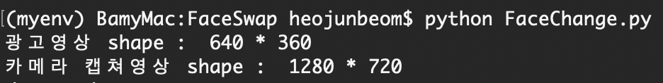

GraduationProjectFinal
=======================

--------------------------------------

JUNBEOM HEO, Undergraduate Student 

Department of Computer Science and Engineering<br>
College of Software <br>
SungKyunKwan University  <br>
2066, Seobu-ro, Jangan-gu, Suwon-si, Gyeonggi-do, Republic of Korea<br>
E-mail: trafalgar23@naver.com / bamy@skku.edu<br>

--------------------------------------

# Face Changer


* How to Implement?

# Environment

MAC OSX

# Prerequisites

Anaconda (3.X recommended) 

# Instructions

```shell
$ conda create -n myenv python=3.5 anaconda
```

```shell
$ source activate myenv
```

```shell
$ conda install -c menpo dlib=18.18
```

```shell
$ conda install -c https://conda.binstar.org/menpo opencv
```

```shell
$ pip install PyOpenGL PyOpenGL_accelerate
```

```shell
$ pip install pygame
```

```shell
$ pip install numpy
```


<em>Intel MKL FATAL ERROR: Error on loading function mkl_blas_avx_xdcopy</em><br>
<u>If this error occurs, link below will be help</u><br>

```shell 
$ conda install nomkl numpy scipy scikit-learn numexpr
```

```shell
$ conda remove mkl mkl-service
```

[Error solution reference](https://github.com/pyinstaller/pyinstaller/issues/2175#issuecomment-245438409)


If you successfully ran this code, you will see <br>



# Description of Codes

```bash


├── FaceChange.py
├── FaceRendering.py
├── ImageProcessing.py
├── NonLinearLeastSquares.py
├── __pycache__
│   ├── FaceRendering.cpython-35.pyc
│   ├── ImageProcessing.cpython-35.pyc
│   ├── NonLinearLeastSquares.cpython-35.pyc
│   ├── drawing.cpython-35.pyc
│   ├── models.cpython-35.pyc
│   └── utils.cpython-35.pyc
├── drawing.py
├── models.py
└── utils.py

```

* NonLinearLeastSquares.py


* drawing.py

* FaceRendering.py

* ImageProcessing.py

* models.py

* utils.py


Reference: https://blog.naver.com/jinohpark79/110189612945

# How it works

* Running Video (2 videos)


[](https://youtu.be/lSGR9kg8rD4?t=0s)<br>
[Running video-1 link](https://youtu.be/lSGR9kg8rD4)<br>

[](https://youtu.be/45nat4zeZWM?t=0s)<br>
[Running video-2 link](https://youtu.be/45nat4zeZWM)<br>

# Related
<ol>
<li>
https://github.com/MarekKowalski/FaceSwap
 </li>
 <li>
https://github.com/hrastnik/FaceSwap
 </li>
 </ol>


